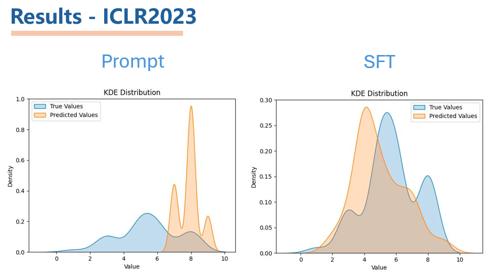
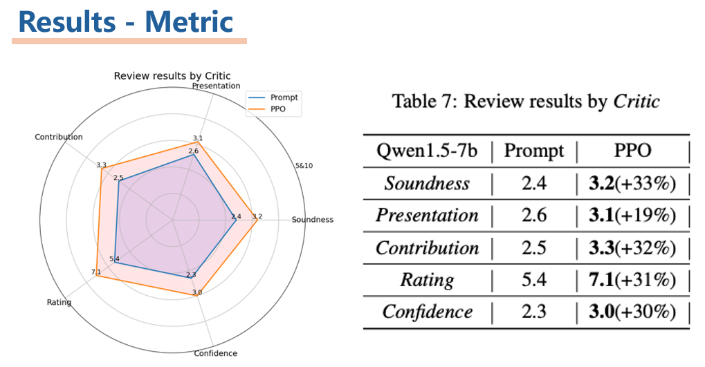

<h1 align="center">
   
  <font size=30>Idea King</font>
</h1>


## Introduction

This project is based on the [LLaMA-Factory](https://github.com/hiyouga/LLaMA-Factory/tree/main) project, which aims to explore the capabilities of large language models (LLMs) in scoring research papers and generating ideas. The LLama-factory framework provides tools and examples for working with LLMs. Users should configure the framework and the base model according to the documentation. In this project, we use Qwen1.5-7b-chat as base model and example.

## Roadmap
<details>

  <summary>click for details</summary>

  To reach the goal of generating better ideas, we first focus on the paper scoring task, which has a relatively well-developed IDEA and a professional evaluation that corresponds to it.

  To let the model generate better ideas, we propose two LLM-based models: the critic model and the king model. 

  
  The critic model is used to score the generated ideas, and the king model is used to generate ideas. The critic model is trained using supervised fine-tuning (SFT) on the LLM. For the King model, we wish to perform RLHF by using a previously trained critical model as a reward model.

- [x] Get the dataset
  We use the Apache format dataset of AI/DL/ML conferences, including paper abstracts, info and reviewers' ratings. We use it for idea quality measuring and idea proposing.
  
  We end up obtain Multi-model Dataset with 100K+ Papers ,300K+ Images&Charts, 2000K+ Reviews, including NIPS 2021-2023, CVPR 2021-2023 and ICLR 2020-2023.
  Click [here](https://github.com/frinkleko/Apache-Conferences-Dataset) for the details of dataset.
  
- [x] The Critic model
  To train the critic model, we use the supervised fine-tuning (SFT) method. We use the 'Qwen1.5-7b-Chat' as the base model and fine-tune it on the dataset. The critic model is used to score the generated ideas.
  
  The loss function is defined as:

  $$\mathcal{L}(\theta) =-\frac{1}{N} \sum_{i=1}^{N} w\left(y_{i}\right) \log P_{\theta}\left(y_{i} \mid x_{i}\right) $$

  And here are help-prompt to trirgger the Critic model for idea evaluating, two modes are defined. One is giving format guide, the other is providing few shot examples. Paper context are included after the help-prompt.
  

- [x] The King model
  For the King model, we use the Critic model we trained as the reward model. And use the Proximal Policy Optimization (PPO) algorithm to train the King model. The King model is used to generate ideas.
  

  To train the King model, we use the PPO algorithm. The hole RLHF-Algorithm is:
  

  

</details>

## Dataset

We use the Alpaca format of the [openreview](https://github.com/frinkleko/Apache-Conferences-Dataset) dataset, which we have open-sourced. Users should configure the dataset according to the requirements of the LLama-factory project.

## Training the Critic Model

To train the critic model, you can use the example provided in our repository. We perform supervised fine-tuning (SFT) of the LLM using multiple GPUs on a single machine. Adjust the parameters in the command as needed.

```bash
bash examples/train/sft.sh
```

## Training the King Model

To train the king model, we use the Proximal Policy Optimization (PPO) algorithm. Use the example provided in our repository. Note that we use the critic as the reward model, so you need to deploy the reward model LLM to a specific port using web.py, and then call it via API during training.

```bash
python web.py
```

At the same time you need to replace the `get_rewards_from_server` function in `src\llamafactory\train\ppo\ppo_utils.py` with ours.

```python
def get_rewards_from_server(server_url: str, messages: List[str]) -> List[str]:
    r"""
    Gets generated strings from the API server and returns them as a list of strings.
    """
    headers = {"Content-Type": "application/json"}
    payload = {"messages": messages}
    response = requests.post(f"{server_url}/generate", json=payload, headers=headers)
    response.raise_for_status()  # make sure success
    rewards = json.loads(response.text)["rewards"]
    return torch.Tensor(rewards)
```

```bash
bash examples/train/qwen1.5_lora_ppo.yaml
```

## Evaluation

- Results of the critic model
  
  
  
  

- Results of the king model
  
  


## Chat with Critic and King

After training, you can use `main.py` to call the functions for dialogue and cross-conference validation with the critic and king models. The corresponding functions are `critic()`, `king()`, and `Eval()`.
